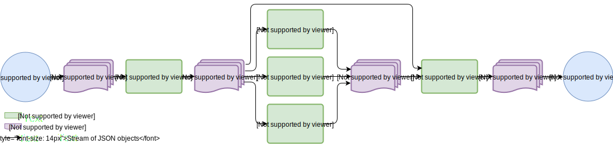

# Nirdizati Runtime on Kafka
This is a now standard version of our tool that decouples Nirdizati's predictive methods to run as Kafka processors.  This allows multiple instances of the predictive methods, and distributing them across multiple machines.

## Requirements
You will need the following components:
* [Node.js](https://nodejs.org/en/), preferably one of the latest versions.
* [Python 2.7](https://www.python.org)
* [Docker](https://www.docker.com) to create software containers
* [Apache Kafka](https://kafka.apache.org). Download it to a directory of your choice henceforth called `$KAFKA_ROOT`
* Kafka client library for Python, it can be installed as `pip install kafka`
* Kafka client library for Node.js, it can be installed as `npm install kafka-node`
* A web browser

Optionally, you may install [Kafka tool](http://www.kafkatool.com/) to quickly view all your Kafka clusters, including their brokers, topics and consumers.

## Project Setup
* Install the required node.js packages by running `npm --loglevel=error install` in the root and *src* folders. You might need root privileges for that.

* Create the Dockerized instance of MongoDB from the standard distribution of Nirdizati. This can be created by executing:
```sh
docker run --name some-mongo -d -p 27017:27017 mongo
```

* Create environmental variables pointing to the root installation of Kafka and Nirdizati, for example:
```sh
export KAFKA_ROOT=/home/user/kafka-0.11.0.0-src/
export NIRDIZATI_ROOT=/home/user/git/nirdizati-runtime/
```

* If you don't have pre-trained predictive methods, create them by executing:

```sh
cd $NIRDIZATI_ROOT
cd PredictiveMethods/CaseOutcome
python train.py bpi12 label  # generates predictive_monitor_bpi12_label.pkl
python train.py bpi17 label  # generates predictive_monitor_bpi17_label.pkl
python train.py bpi17 label2  # generates predictive_monitor_bpi17_label2.pkl

cd PredictiveMethods/RemainingTime
python train.py bpi12  # generates predictive_monitor_bpi12.pkl
python train.py bpi17  # generates predictive_monitor_bpi17.pkl
```

* Run a Zookeeper service at `localhost:2181`.

```sh
cd $KAFKA_ROOT
bin/zookeeper-server-start.sh config/zookeeper.properties
```

You must explicitly enable the deletion of Kafka topics by editing `$KAFKA_ROOT/config/server.properties` and ensuring that it includes `delete.topic.enable=true`.

* Next, run a Kafka broker at `localhost:9092`.

```sh
cd $KAFKA_ROOT
bin/kafka-server-start.sh config/server.properties
```

* Finally, run the following script to create and start the dataflow depicted in Figure 1.

```sh
cd $NIRDIZATI_ROOT
NODE_ENV='development' python deploy-kafka.py localhost:2181 localhost:9092 $KAFKA_ROOT $NIRDIZATI_ROOT
```

Open a web browser to [http://localhost:8080](http://localhost:8080).

The web browser should begin to show updates.


